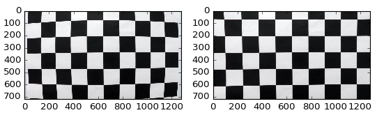
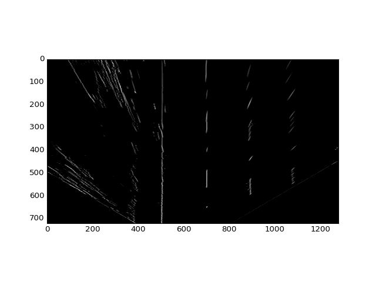
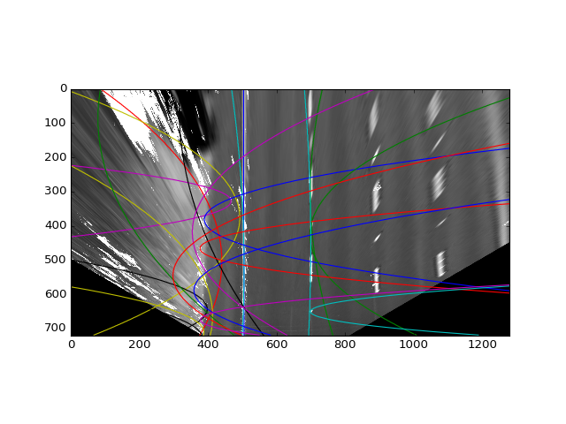
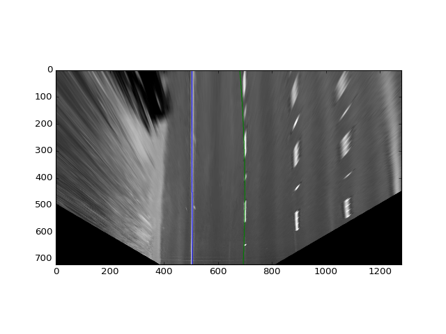
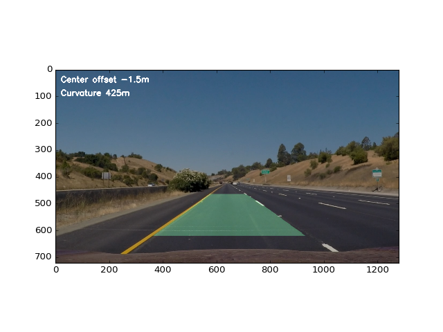

**Advanced Lane Finding Project**

The goals / steps of this project are the following:

* Compute the camera calibration matrix and distortion coefficients given a set of chessboard images.
* Apply a distortion correction to raw images.
* Use color transforms, gradients, etc., to create a thresholded binary image.
* Apply a perspective transform to rectify binary image ("birds-eye view").
* Detect lane pixels and fit to find the lane boundary.
* Determine the curvature of the lane and vehicle position with respect to center.
* Warp the detected lane boundaries back onto the original image.
* Output visual display of the lane boundaries and numerical estimation of lane curvature and vehicle position.

## [Rubric](https://review.udacity.com/#!/rubrics/571/view) Points
### Here I will consider the rubric points individually and describe how I addressed each point in my implementation.  

---
### Writeup / README

The project is implemented in the file "Project 4 - Advanced Lanes.ipynb".

### Pipeline (single images)

### Camera Calibration

#### 1. Briefly state how you computed the camera matrix and distortion coefficients. Provide an example of a distortion corrected calibration image.

The code for this step is contained in the code cell "Distortion Compensation".

I start by preparing "object points", which will be the (x, y, z) coordinates of the chessboard corners in the world. Here I am assuming the chessboard is fixed on the (x, y) plane at z=0, such that the object points are the same for each calibration image.  Thus, `objp` is just a replicated array of coordinates, and `objpoints` will be appended with a copy of it every time I successfully detect all chessboard corners in a test image.  `imgpoints` will be appended with the (x, y) pixel position of each of the corners in the image plane with each successful chessboard detection.  

I then used the output `objpoints` and `imgpoints` to compute the camera calibration and distortion coefficients using the `cv2.calibrateCamera()` function.  I applied this distortion correction to the test image using the `cv2.undistort()` function and obtained this result: 



#### 2. Describe how (and identify where in your code) you performed a perspective transform and provide an example of a transformed image.

The code for my perspective transform includes a function called `get_road()` defined in the section "Perspective Transform".  The `get_road()` function takes as inputs an image (`img`). Source (`src`) and destination (`dst`) points are hardcoded assuming that the camera is thoroughly fixed in the car:

```
src = np.float32([
        [253, 685],
        [572, 465],
        [709, 465],
        [1052, 685]])

dst = np.float32([
        [500, 750],
        [500, 300],
        [700, 300],
        [700, 750]])
```

I verified that my perspective transform was working as expected by verifying that straight road lane lines appear parallel in the warped image.


#### 3. Describe how (and identify where in your code) you used color transforms, gradients or other methods to create a thresholded binary image.  Provide an example of a binary image result.
After unwraping images with the parameters above, lane lines should have width of 8 pixels and be of white or yellow color.

`Line` is a Python class containing coefficients of 2nd order polynomial that describes the line.

Color filtering is done in `find_lanes`. Image with maximum of yellow and white is taken and passed to function `find_bright_lanes` which returns left and right `Lines`.

`find_bright_lanes` accepts gray image where features (yellow and white from original image) are brighter than everything else. Gray image is first normalized to be in the range [0..1]. Line divider should be 8 bright pixels surrounded by 4 pixels of dark areas on both sides. So a kernel is constructed to match this desired shape

    -1 -1 -1 -1 1 1 1 1 1 1 1 1 -1 -1 -1 -1

and applied using `cv2.filter2D` to the gray image. Anything below 0.05 is cut off.



Adjacent pixel groups are labeled using `scipy.ndimage.measurements.label`. A polynomial is fit through each group that consists of more than 50 pixels and has pixels in the central bottom area of the image (method `extract_lines`).



Then all line pairs are measured for 'quality' in the function `line_pair_quality`. Left and right line pair is a good candidate if they are parallel and go through desired left and right locations at the bottom of the image (`x` cooridnates 513 and 693 correspondingly). `find_best_line_pair` finds a pair with lowest value of `line_pair_quality` (by convention the best pair). Found lines are stabilized using lines found on the previous image. 



#### 5. Describe how (and identify where in your code) you calculated the radius of curvature of the lane and the position of the vehicle with respect to center.

A `lane_direction` polynomial is built as average of left and right lines and is used to calculate road curvature and car offset. 80 pixels is roughly 3 meters.

#### 6. Provide an example image of your result plotted back down onto the road such that the lane area is identified clearly.

The function `process_image` draws a polygon between left and right lines to highlight detected lane. It then unwraps polygon using reverse perspective transform defined in `unwarp` and applies it to he original image. It also prints curvature and car offset.



---

### Pipeline (video)

#### 1. Provide a link to your final video output.  Your pipeline should perform reasonably well on the entire project video (wobbly lines are ok but no catastrophic failures that would cause the car to drive off the road!).

[Result Video](./project_video-output.mp4)

---

### Discussion

#### 1. Briefly discuss any problems / issues you faced in your implementation of this project.  Where will your pipeline likely fail?  What could you do to make it more robust?

Debugging in Notebook is not very convenient because I have to scroll back and forth especially when there are lots of output images.
Python is very slow for pixel-level processing. I've tried this route and failed to achieve anything reasonable.
Fitting lines based on adjacent pixel gropus often leads to lines with low accuracy. It would be better to try and fit polynomials through several groups at once - this should work better for broken lane separators. I found python too slow for this kind of approach to be practical. Also each line should have a "quality" measure. If it's a long, narrow, perfectly yellow line close to the line on the previous frame then it's of high quality whereas if it's a white floc with unclear direction then it should probably be only considered together with some other better whitish piece of line.
It's good to have test images with marked up lines which would allow testing of algorithms and their stability. Unfortunately I thought of this too late. I wrote a couple of tests for best line pair selection code: `test` and `test2` methods.
My current measure of "line quality" takes into account how close the lines are to where they are expected to be. This means that when changing lanes the algorithm will be confused and won't be able to detect both lanes when car is driving between them.